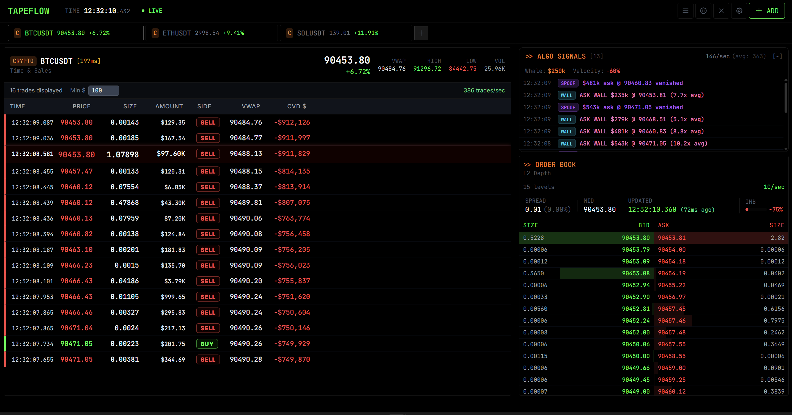

# TapeFlow

Real-time crypto tape reader. Shows order flow, whale trades, and spoofing as it happens.

[](https://www.typescriptlang.org/)
[](https://reactjs.org/)
[](https://nodejs.org/)
[](https://opensource.org/licenses/MIT)



---

## Why I Built This

Candlestick charts are lagging indicators. By the time you see a green candle, the buyers already bought. I wanted to see the raw trades happening _right now_—who's buying, who's selling, and how big.

Problem is, BTC can push 500+ trades/sec when things get spicy. Tried the naive approach (setState on every message), browser froze instantly. So I built a buffer system that decouples WebSocket ingestion from React rendering. Data comes in at wire speed, UI updates at 60fps.

---

## What It Does

- Handles 500+ trades/sec without choking
- Whale alerts when big money moves ($250k+ on BTC, $50k+ on alts)
- Spoof detection—flags large orders that vanish within 2 seconds
- Velocity alerts when trade frequency spikes +300% above average
- CVD (cumulative volume delta) to see net buying/selling pressure
- Wall detection for big resting orders at key levels

---

## Stack

**Frontend:** React 18, TypeScript, Vite, Tailwind, Zustand  
**Backend:** Node/Express WebSocket proxy  
**Data:** Binance public streams (no API key needed)

---

## How It Works

WebSocket messages go into plain JS arrays, not React state. A render loop runs at 60fps, pulls batches from the buffer, and calls setState once per frame.

500 messages/sec → 60 re-renders/sec. That's the trick.

|            | Before              | After    |
| ---------- | ------------------- | -------- |
| Throughput | ~50/sec then freeze | 500+/sec |
| Frame rate | 5-10 fps            | 60 fps   |
| Latency    | 500ms+              | <16ms    |

---

## Run It

```bash
git clone https://github.com/ianfigueroa/TapeFlow.git
cd TapeFlow

# backend
cd backend && npm install && npm run dev

# frontend (new terminal)
cd frontend && npm install && npm run dev
```

Open http://localhost:5173. Works with any Binance USDT pair.

---

## License

MIT
