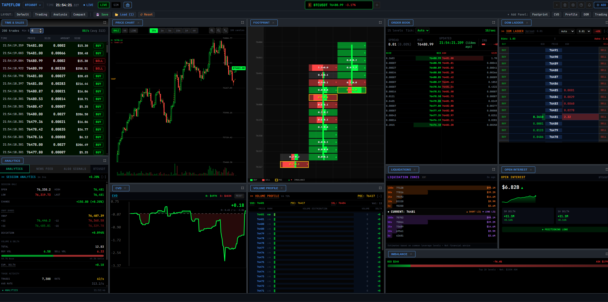

# TapeFlow



Production-grade real-time trading terminal for order flow analysis. Designed for low-latency visualization of high-frequency cryptocurrency market data with professional-grade tooling for tape reading, footprint analysis, and paper trading.

## Features

- Real-time Time and Sales tape with whale trade highlighting
- Footprint charts with volume heatmap coloring
- DOM Ladder with price level imbalance detection
- Cumulative Volume Delta (CVD) overlay
- Volume Profile with Point of Control
- Open Interest monitoring with delta tracking
- Liquidation heatmap visualization
- Algorithmic signal detection (whale trades, velocity surges, spoofing, walls)
- Sound alerts and desktop notifications
- Paper trading with realistic slippage simulation
- Session analytics (VWAP, session high/low, delta stats)
- Fully customizable dockable workspace layout
- Multiple color themes (Matrix, Bloomberg, Tradovate)

## Architecture

### Data Flow

```
Binance WebSocket (500+ msg/sec)
    |
    v
Node.js Proxy Server (port 3001)
    |
    +---> Trade stream normalization
    +---> Order book aggregation
    +---> Open interest tracking
    +---> Liquidation feed
    |
    v
React Application
    |
    +---> dataBuffer.ts (mutable ring buffer)
    |         - Stores last 5000 trades per symbol
    |         - Subscriber pattern for components
    |         - O(1) append, bounded memory
    |
    +---> Component Layer
              |
              +---> TapeTable (virtualized, @tanstack/react-virtual)
              +---> FootprintChart (canvas, heatmap coloring)
              +---> ChartPanel (TradingView lightweight-charts)
              +---> OrderBook (100ms throttled updates)
              +---> DOMLadder (bid/ask imbalance)
              +---> CVDOverlay (cumulative delta chart)
              +---> VolumeProfile (volume at price)
              +---> OIMonitor (open interest delta)
              +---> LiquidationHeatmap (liquidation clustering)
              +---> AlgoSignals (whale/velocity/spoof detection)
              +---> ExecutionPanel (paper trading interface)
              +---> SessionStats (VWAP, session metrics)
```

### Mutable Buffer Architecture

At 500+ trades per second, immutable state updates cause severe performance degradation. TapeFlow uses mutable ring buffers with a subscriber pattern:

```typescript
// dataBuffer.ts - Core pattern
const tradeBuffer = new Map<string, Trade[]>();

export function appendTrade(trade: Trade) {
  const buffer = tradeBuffer.get(trade.symbol) || [];
  buffer.push(trade);
  if (buffer.length > MAX_TRADES) buffer.shift();
  tradeBuffer.set(trade.symbol, buffer);
  notifySubscribers(trade);
}

export function subscribeToTrades(callback: (trade: Trade) => void) {
  subscribers.add(callback);
  return () => subscribers.delete(callback);
}
```

Components subscribe to the buffer and receive trades directly, avoiding React re-render overhead.

### Workspace Layout System

TapeFlow uses flexlayout-react for a professional dockable workspace:

- Drag tabs to dock panels anywhere (left, right, top, bottom, center)
- Resize panels by dragging borders
- Save and load custom layouts
- Layout presets for different trading styles
- Layout persistence across sessions via localStorage

Layout version tracking ensures users get updated default layouts when new panels are added.

### Alert System

The AlertManager provides centralized sound and notification handling:

```typescript
// AlertManager.ts
class AlertManager {
  // Web Audio API for sound generation (no external files)
  playSound(type: AlertType): void;

  // Browser Notification API for desktop alerts
  showDesktopNotification(title: string, body: string): void;

  // Combined alert with cooldown tracking
  triggerAlert(title: string, message: string, type: AlertType): void;
}
```

Alert types with distinct audio signatures:

- Whale trade: Deep 600Hz tone
- Price break: Sharp 1200Hz chirp
- Velocity surge: Medium 900Hz tone
- Wall detection: Low 400Hz rumble
- Spoof detection: Quick 1500Hz chirp

Configurable via Settings Panel:

- Enable/disable sound alerts
- Enable/disable desktop notifications
- Adjustable cooldown period (1-300 seconds)

### Algo Signal Detection

AlgoSignals component monitors for trading patterns in real-time:

| Signal          | Detection Method                    | Threshold              |
| --------------- | ----------------------------------- | ---------------------- |
| Whale Trade     | Single trade value                  | >$50K (>$250K for BTC) |
| Velocity Surge  | Trades per second vs 30s average    | >300% spike            |
| Wall Detection  | Large resting orders at price level | >$100K unfilled        |
| Spoof Detection | Orders that disappear before fill   | >$50K removed          |
| Imbalance       | Bid/ask volume ratio at level       | >3:1 ratio             |

### Paper Trading Engine

ExecutionPanel provides simulated order execution:

```
PaperTradingStore
    |
    +---> Order Entry
    |         - Market orders (instant fill at current price)
    |         - Limit orders (fill when price crosses)
    |         - Order size in USD or contracts
    |
    +---> Position Management
    |         - Long/short position tracking
    |         - Average entry price calculation
    |         - Real-time P&L (unrealized + realized)
    |
    +---> Risk Controls
    |         - Max position size limits
    |         - Stop loss percentage
    |         - Daily loss limits
    |
    +---> Execution Simulation
              - Configurable slippage (basis points)
              - Trading fee simulation
              - Fill against real L1 data
```

### Session Analytics

SessionStats component tracks intraday metrics:

- Session OHLC (open, high, low, current)
- VWAP (Volume Weighted Average Price)
- Session delta (buy volume - sell volume)
- Total session volume
- Price change from session open

### Canvas Rendering Engine

Single requestAnimationFrame loop drives all canvas layers:

```
LayerManager (60fps RAF)
    |
    +---> BackgroundLayer (z:0)   - Grid, axis
    +---> HeatmapLayer (z:10)     - Order book depth, log10 scaling
    +---> FootprintLayer (z:20)   - Cluster charts with heatmap coloring
    +---> IndicatorLayer (z:30)   - VWAP, liquidity zones
    +---> OverlayLayer (z:40)     - Crosshair, tooltips
```

Footprint heatmap coloring uses volume intensity:

```typescript
const intensity = Math.min(volume / globalMaxVolume, 1);

// Color gradient: dark blue -> cyan -> yellow -> white
const getHeatmapColor = (intensity: number): string => {
  if (intensity < 0.25)
    return `rgba(0, ${Math.floor(intensity * 4 * 200)}, 255, 0.8)`;
  if (intensity < 0.5)
    return `rgba(0, 200, ${Math.floor(255 - (intensity - 0.25) * 4 * 200)}, 0.9)`;
  if (intensity < 0.75)
    return `rgba(${Math.floor((intensity - 0.5) * 4 * 255)}, 200, 0, 0.95)`;
  return `rgba(255, ${Math.floor(200 + (intensity - 0.75) * 4 * 55)}, 0, 1.0)`;
};
```

### Analytics Calculators

Calculators operate on raw data with no React dependencies:

| Calculator            | Purpose                 | Method                       |
| --------------------- | ----------------------- | ---------------------------- |
| OPSCalculator         | Orders per second       | Binary search sliding window |
| CVDCalculator         | Cumulative volume delta | Time-bucketed aggregation    |
| SpreadAnalyzer        | Bid-ask spread stats    | 60-sample circular buffer    |
| OBICalculator         | Order book imbalance    | Top 10 levels weighted       |
| IcebergDetector       | Hidden order detection  | Refill pattern tracking      |
| LiquidityZoneDetector | Support/resistance      | Persistent large orders      |

## Directory Structure

```
TapeFlow/
|
+-- backend/                 # Node.js WebSocket proxy
|   +-- server.ts           # Express + WS server (port 3001)
|   +-- types.ts            # Shared type definitions
|   +-- adapters/           # Exchange adapters
|       +-- binance.ts      # Binance spot + futures
|       +-- newsAdapter.ts  # News feed integration
|
+-- frontend/               # React + Vite application
|   +-- src/
|       +-- components/     # UI components
|       |   +-- TapeTable.tsx
|       |   +-- FootprintChart.tsx
|       |   +-- ChartPanel.tsx
|       |   +-- OrderBook.tsx
|       |   +-- DOMLadder.tsx
|       |   +-- CVDOverlay.tsx
|       |   +-- VolumeProfile.tsx
|       |   +-- OIMonitor.tsx
|       |   +-- LiquidationHeatmap.tsx
|       |   +-- AlgoSignals.tsx
|       |   +-- ExecutionPanel.tsx
|       |   +-- SessionStats.tsx
|       |   +-- TapeFlowWorkspace.tsx
|       |   +-- SettingsPanel.tsx
|       |   +-- DashboardLayout.tsx
|       |
|       +-- stores/         # Zustand state management
|       |   +-- useMarketStore.ts
|       |   +-- useSettingsStore.ts
|       |   +-- usePaperTradingStore.ts
|       |
|       +-- services/       # Data layer
|       |   +-- dataBuffer.ts
|       |   +-- clock.ts
|       |
|       +-- utils/          # Utilities
|       |   +-- AlertManager.ts
|       |   +-- formatters.ts
|       |
|       +-- analytics/      # Calculators
|       +-- engine/         # Canvas rendering
|       +-- alerts/         # Alert conditions
|       +-- types/          # TypeScript definitions
|
+-- cpp-engine/             # C++ Hyperion simulation (optional)
|   +-- include/
|   +-- src/
|   +-- CMakeLists.txt
|
+-- docs/
    +-- ARCHITECTURE.md     # Detailed architecture docs
```

## Configuration

### Settings Panel

Access via the gear icon in the header. Tabs include:

- **Colors**: Customize buy/sell colors, accent colors, theme presets
- **Display**: Toggle components, adjust update rates
- **Trading**: Paper trading parameters (slippage, fees, position limits)
- **Alerts**: Sound and notification preferences
- **Hotkeys**: Keyboard shortcut reference
- **Profiles**: Save and load setting profiles

### Keyboard Shortcuts

| Key    | Action                             |
| ------ | ---------------------------------- |
| Space  | Pause/resume Time and Sales scroll |
| S      | Focus symbol search                |
| A      | Toggle alerts panel                |
| ?      | Show keyboard shortcuts            |
| R      | Reset/clear trades                 |
| 1-9    | Switch to symbol tab               |
| Ctrl+W | Close current tab                  |

## Performance

| Metric           | Target   | Achieved |
| ---------------- | -------- | -------- |
| Trade throughput | 500+/sec | 800+/sec |
| Render rate      | 60fps    | 60fps    |
| Input latency    | <16ms    | <10ms    |
| Memory (heap)    | <100MB   | ~80MB    |

## Getting Started

### Prerequisites

- Node.js 18+
- npm or yarn

### Installation

```bash
# Clone the repository
git clone https://github.com/ianfigueroa/TapeFlow.git
cd TapeFlow

# Install backend dependencies
cd backend
npm install

# Install frontend dependencies
cd ../frontend
npm install
```

### Running

```bash
# Terminal 1: Start backend server
cd backend
npm run dev

# Terminal 2: Start frontend dev server
cd frontend
npm run dev
```

Open http://localhost:5173 in your browser.

### Building for Production

```bash
# Build frontend
cd frontend
npm run build

# Build backend
cd ../backend
npm run build
```

## Stack

- **Frontend**: React 18, TypeScript, Vite, Zustand, TailwindCSS
- **Backend**: Node.js, Express, WebSocket (ws)
- **Charts**: TradingView lightweight-charts, Canvas API
- **Virtualization**: @tanstack/react-virtual
- **Layout**: flexlayout-react
- **Data**: Binance Spot and Futures WebSocket streams

## Optional: Hyperion Engine

The cpp-engine directory contains an optional C++ market simulator for testing:

```bash
cd cpp-engine
mkdir build && cd build
cmake ..
cmake --build . --config Release
./Release/hyperion.exe
```

See cpp-engine/README.md for details on the simulation parameters.

## License

MIT
