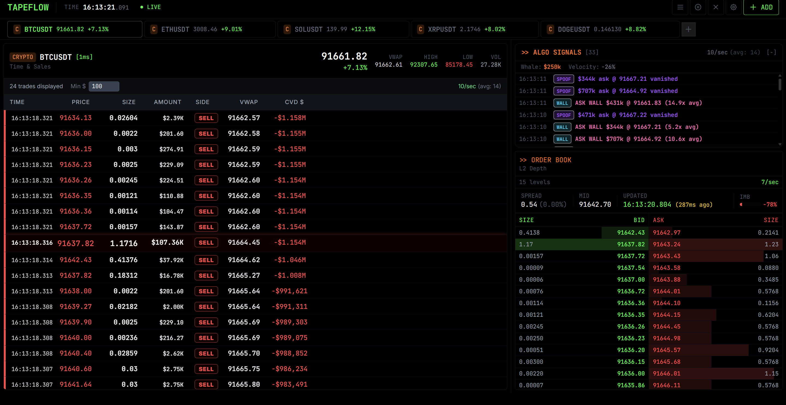

# TapeFlow

Real-time crypto tape reader and order flow analysis dashboard for high-frequency trading. Visualizes trades, liquidations, order book depth, and market microstructure as it happens.

[](https://www.typescriptlang.org/)
[](https://reactjs.org/)
[](https://nodejs.org/)
[](https://isocpp.org/)
[](https://opensource.org/licenses/MIT)



---

## Why I Built This

Candlestick charts are lagging indicators. By the time you see a green candle, the buyers already bought. I wanted to see the raw trades happening _right now_—who's buying, who's selling, and how big.

Problem is, BTC can push 500+ trades/sec when things get spicy. Tried the naive approach (setState on every message), browser froze instantly. So I built a buffer system that decouples WebSocket ingestion from React rendering. Data comes in at wire speed, UI updates at 60fps.

---

## What It Does

- Handles 500+ trades/sec without choking
- Whale alerts when big money moves ($250k+ on BTC, $50k+ on alts)
- Spoof detection—flags large orders that vanish within 2 seconds
- Velocity alerts when trade frequency spikes +300% above average
- CVD (cumulative volume delta) to see net buying/selling pressure
- Wall detection for big resting orders at key levels
- Real-time price, volume, and delta charts
- VWAP overlay for mean-reversion analysis
- Configurable colors and theme profiles
- High-frequency simulation mode (Hyperion engine)
- Forced liquidation tracking with distinct visual indicators
- Order book depth heatmap visualization

---

## Features

### Order Flow Visualization

- **Time and Sales Tape**: Real-time trade stream with price, size, and side
- **Sliding Window OPS**: Accurate orders-per-second counter using real-time sliding window (not interval-based)
- **Whale Highlighting**: Large trades get special styling and glow effects
- **Trade Aggregation**: Clusters rapid trades at same price for cleaner display

### Liquidation Feed

Track forced liquidations separately from regular trades:

- **Long Liquidations**: Purple highlighting with skull icon (rekt longs)
- **Short Liquidations**: Orange highlighting with skull icon (rekt shorts)
- **Real-time Stream**: Connects to Binance Futures forceOrder WebSocket
- **Distinct from CVD**: Liquidations are visually separated from normal order flow

### Order Book Heatmap

Canvas-based depth visualization showing liquidity over time:

- **Price x Time Matrix**: Y-axis shows price levels, X-axis shows time history
- **Color Scale**: Dark blue/black (low liquidity) to yellow/white (walls)
- **100ms Snapshots**: Stores order book state every 100ms for smooth animation
- **Wall Detection**: Bright spots indicate large resting orders

### Chart Visualizations

Toggle real-time charts from the settings panel:

- Price line chart with time series
- Volume bars overlay
- VWAP (Volume Weighted Average Price) indicator
- Cumulative Delta (order flow) chart
- Readable labels with semi-transparent backgrounds
- Adjustable chart height

### Configurable Colors

Customize the UI colors to your preference:

- Buy/sell colors and backgrounds
- Size-based intensity (larger trades get brighter colors)
- Whale threshold customization
- Chart line colors
- Save and load theme profiles (Terminal, Classic, Ocean, High Contrast)

### Hyperion Simulation Engine

Switch to SIM mode to run the C++ high-frequency trading simulator:

- 700k+ orders per second throughput
- Realistic trader personas (Market Makers, Retail, Institutional, Algos)
- Mean-reverting price dynamics
- Order flow imbalance simulation
- WebSocket telemetry on port 9001

---

## Stack

**Frontend:** React 18, TypeScript, Vite, Tailwind, Zustand, Canvas rendering  
**Backend:** Node/Express WebSocket proxy, Binance Spot + Futures streams  
**Engine:** C++20 high-frequency simulator (Hyperion)  
**Data:** Binance public streams (no API key needed)

---

## How It Works

WebSocket messages go into plain JS arrays, not React state. A render loop runs at 60fps, pulls batches from the buffer, and calls setState once per frame.

500 messages/sec → 60 re-renders/sec. That's the trick.

|            | Before              | After    |
| ---------- | ------------------- | -------- |
| Throughput | ~50/sec then freeze | 500+/sec |
| Frame rate | 5-10 fps            | 60 fps   |
| Latency    | 500ms+              | <16ms    |

---

## Run It

```bash
git clone https://github.com/ianfigueroa/TapeFlow.git
cd TapeFlow

# backend
cd backend && npm install && npm run dev

# frontend (new terminal)
cd frontend && npm install && npm run dev
```

Open http://localhost:5173. Works with any Binance USDT pair.

### Simulation Mode

To use the Hyperion simulation engine:

```bash
cd cpp-engine/build
cmake --build . --config Release
./Release/hyperion.exe  # Windows
./hyperion              # Linux/Mac
```

Then click "SIM" in the frontend header to switch to simulation mode.

---

## License

MIT
